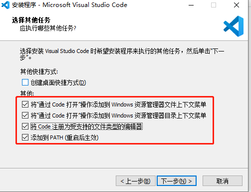
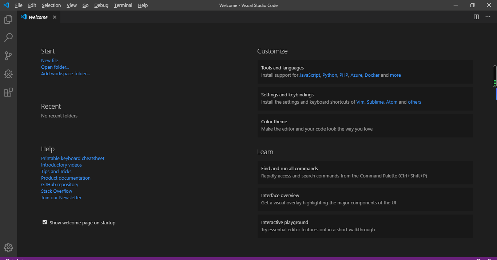
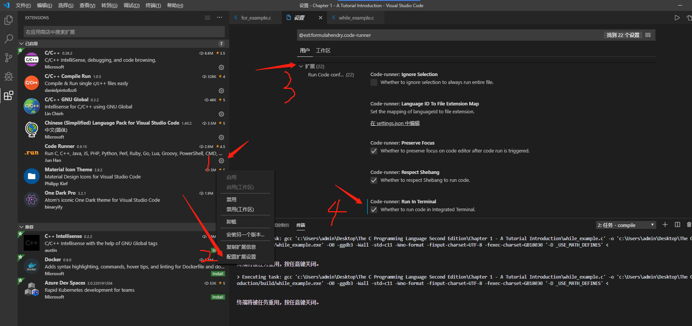
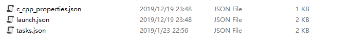
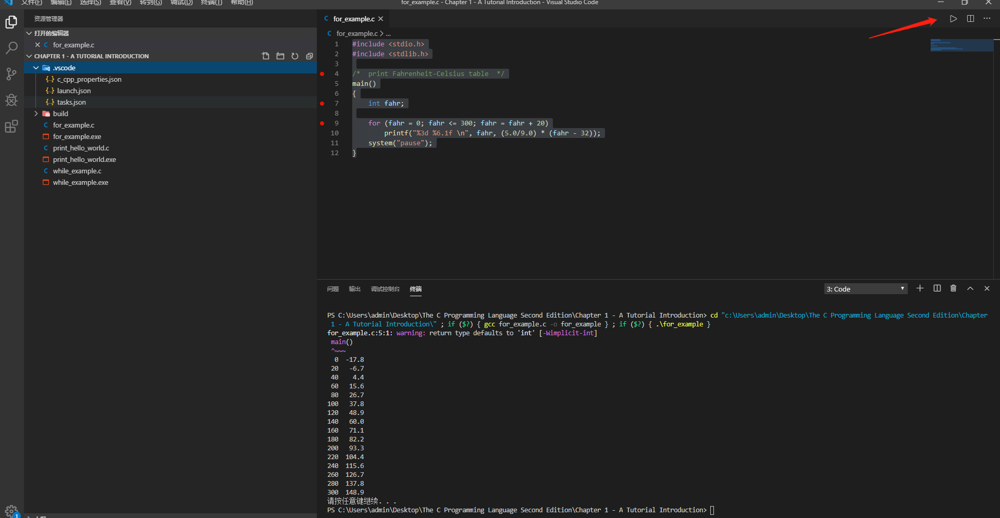
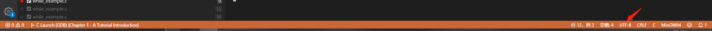
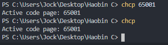

## 1. 前言

Visual Studio Code 搭建 C 语言的开发环境，网上有一大堆的教程，但是很多都要么过时了，要么就是不能运行，自己也踩了好几个坑。
比较好的策略就是[官网教程](https://code.visualstudio.com/docs/cpp/config-mingw) + B 站 + 知乎，尤其是 B 站的教学视频非常的多，播放量前几的都是很良心的。本文最后也会给出相应的 B 站链接，感谢这些博主的贡献。

## 2. 下载安装 VSCode 以及 MinGW

### 2.1 下载安装 VSCode

1.官网下载安装符合自己操作系统的安装包，我这里安装的是 VSCodeSetup-x64-1.40.2 [官网下载 VSCode 安装包 Windows System Installer 64 bit](https://code.visualstudio.com/download#)

2. 一路点点点，需要注意一点，出现以下界面时注意把这些都勾上。



安装成功后打开是这个界面：



### 2.2 下载安装 MinGW-w64

[官网](https://sourceforge.net/projects/mingw-w64/files/)

1. 下载软件，我这里是下载的[x86_64-8.1.0-release-posix-seh-rt_v6-rev0.7z](https://sourceforge.net/projects/mingw-w64/files/Toolchains%20targetting%20Win64/Personal%20Builds/mingw-builds/8.1.0/threads-posix/seh/x86_64-8.1.0-release-posix-seh-rt_v6-rev0.7z/download)
2. 解压软件，下载完成后解压软件，并把里面的文件夹 mingw64 放到 C 盘的根目录下。
3. 添加 mingw64 里面的 bin 文件夹到系统环境变量。
4. 进入 windows 控制台检验是否添加成功。若成功则如下所示：

```c
C:\Users\Jock>gcc
gcc: fatal error: no input files
compilation terminated.

C:\Users\Jock>g++
g++: fatal error: no input files
compilation terminated.
```

## 3. 添加 VSCode 的 C 语言开发插件

1. **Chinese (Simplified) Language Pack for Visual Studio Code**插件，安装了这个插件，VSCode 就变为中文界面了，对新手就友好多了。
2. **C/C++**插件，写 C/C++的插件。
3. **Code Runner**插件，一键运行 C/C++/Python/Java 等语言程序的插件。注意，这里需要配置一下`配置扩展配置`，把`run in terminal`勾选上。



4. **Material Theme** 插件，显示不同的主题。
5. **C/C++ GNU Global** 插件。
6. **Material Icon Theme** 插件，更好的显示各个文件的图标，便于区分。
7. **C/C++ Compile Run** 插件。
8. **Prettier - Code formatter** 插件，用于格式化文档和代码。

## 4. 配置 C 语言开发环境

另外要使用 VSCode 完成 C 语言开发环境的配置，需要配置三个文件。在电脑桌面新建一个 C 文件夹，然后在里面新建以下两个文件夹。**注意：路径里面一定不能有中文出现。**


然后再在`.vscode`中新建以下三个文件。



文件内容见后文。

### 4.1 配置 c_cpp_properties.json

```c
{
    "configurations": [
        {
            "name": "MinGW64",
            "intelliSenseMode": "gcc-x64",
            "compilerPath": "C:\\mingw64\\bin\\gcc.exe",
            "includePath": [
                "${workspaceFolder}"
            ],
            "cStandard": "c11"
        }
    ],
    "version": 4
}
```

注意，这里你需要把 `"compilerPath": "C:\\mingw64\\bin\\gcc.exe"` 换成你的安装路径，如果你和我一样，默认就好。

### 4.2 配置 launch.json 文件

```c
{
    "version": "0.2.0",
    "configurations": [
        {
            "name": "C Launch (GDB)", // 配置名称，将会在启动配置的下拉菜单中显示
            "type": "cppdbg", // 配置类型，这里只能为cppdbg
            "request": "launch", // 请求配置类型，可以为launch（启动）或attach（附加）
            "targetArchitecture": "x64", // 生成目标架构，一般为x86或x64
            "program": "${fileDirname}/build/${fileBasenameNoExtension}.exe", // 将要进行调试的程序的路径
            "args": [], // 程序调试时传递给程序的命令行参数，一般设为空即可
            "stopAtEntry": false, // 设为true时程序将暂停在程序入口处，一般设置为false
            "cwd": "${workspaceRoot}", // 调试程序时的工作目录，一般为${workspaceRoot}
            "externalConsole": true, // 调试时是否显示控制台窗口，一般设置为true显示控制台
            "internalConsoleOptions": "neverOpen", // 如果不设为neverOpen，调试时会跳到“调试控制台”选项卡",
            "MIMode": "gdb", // 指定连接的调试器
            "miDebuggerPath": "C:\\mingw64\\bin\\gdb.exe", // 调试器路径
            "setupCommands": [
                {
                    "description": "Enable pretty-printing for GDB",
                    "text": "-enable-pretty-printing",
                    "ignoreFailures": false
                }
            ],
            "preLaunchTask": "compile"
        }
    ]
}
```

注意，这里你需要把 `"miDebuggerPath": "C:\\mingw64\\bin\\gdb.exe"` 换成你的安装路径，如果你和我一样，默认就好。

### 4.3 配置 tasks.json 文件

```c
{
    "version": "2.0.0",
    "tasks": [
        {
            "label": "compile",
            "command": "gcc",
            "args": [
                "${file}", // 指定编译源代码文件
                "-o",
                "${fileDirname}/build/${fileBasenameNoExtension}.exe", // 指定输出文件名
                "-O0", // 优化级别
                "-ggdb3", // 生成和调试有关的信息
                "-Wall", // 开启额外警告
                "-std=c11", // 使用c11标准
                "-Wno-format",
                "-finput-charset=UTF-8", //输入编译器文本编码 默认为UTF-8
                "-fexec-charset=GB18030",
                "-D _USE_MATH_DEFINES"
            ],

            "type": "shell",

            "group": {
                "kind": "build",
                "isDefault": true
            },

            "presentation": {
                "echo": true,
                "reveal": "always", // 在“终端”中显示编译信息的策略，可以为always，silent，never
                 "focus": false,
                 "panel": "shared" // 不同的文件的编译信息共享一个终端面板
            },
        }
    ]
}
```

## 5. 测试 C 语言开发环境

如图：新建一个`for_example.c`文件。可以按 F5 进行调试，或者直接右键 run code。run code 成功会输出如图所示。



```c
#include <stdio.h>
#include <stdlib.h>

/* print Fahrenheit-Celsius table */
main()
{
    int fahr;

    for (fahr = 0; fahr <= 300; fahr = fahr + 20)
        printf("%3d %6.1f \n", fahr, (5.0/9.0) * (fahr - 32));
    system("pause");
}
```

## 6. 配置中遇到的坑

配置过程中会遇到各种各样的问题，这时候需要多思考，去 Google 或者百度寻找答案。这里我把自己遇到的坑总结一下。

1. 路径找不到的问题。1）查看是否添加环境变量成功；2）查看是否 gcc.exe 和 gdb.exe 文件的位置和三个配置文件是否对应；3）路径中是否存在中文。
2. 中文乱码问题。因为最新的 VSCode 默认用 UTF-8 编码，所以一般问题不大，遇到了重新设置一下编码就行。在 VSCode 界面的右下方点击可以设置。



3. 如果输出的终端还是乱码，这是时候很可能是因为你的 windows 系统，默认终端是 GBK2312 编码。
   使用`chcp`命令，查看`cmd`的编码设置，`GBK2312`的代码页编号是`936`；


改成`utf-8`的编码，utf-8 对应的代码页编号是`65001`
执行`chcp 65001`就可以把 cmd 的编码设置成`uft-8`。



这个方法的缺陷在于，只能保证这个 cmd 是'utf-8'，换成其他 cmd 就会变回`GBK2312`。

4. Debug 过程中，遇到有中文名称的路径会导致调试失败，这是 mingw 的 gdb 本身不支持中文路径名造成的，如果你要用 gdb 调试的话就不能有中文字符出现在路径名里。
5. VSCode 默认需要你去手动保存，否则不会保存，需要你一直 Crtl + S 很麻烦，尤其是测试代码时，不保存，就不会运行修改后的代码。方法是： 文件 --> 勾上自动保存，以及 文件 --> 首选项 --> 设置 --> 常用设置 --> files: Auto Save --> OnFucosChange(这里可以自行选择，我的这个是当编辑器失去焦点时自行保存)。自己也要多按保存，以防万一。

## 7. 参考文献

站在巨人的肩膀上，总能帮助我们更好的前行。作为小白，VSCode 的配置我也踩了很多坑，看了没有能复现的博文，浪费了一些时间，这里特别感谢以下几个博主的教程。如果大家有什么疑问，欢迎大家在博客下面留言交流，一起进步！

1. [Visual Studio Code 如何编写运行 C、C++ 程序？](https://www.zhihu.com/question/30315894)
2. [Using Mingw-w64 in VS Code](https://code.visualstudio.com/docs/cpp/config-mingw)
3. [B 站鹅弹博主的教学视频](https://www.bilibili.com/video/av18436497?p=2)
